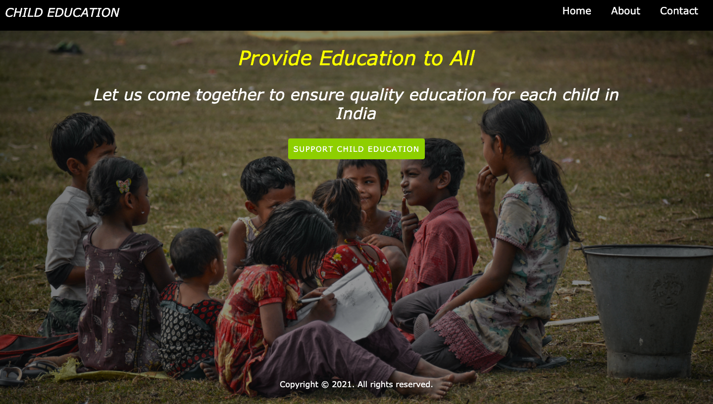
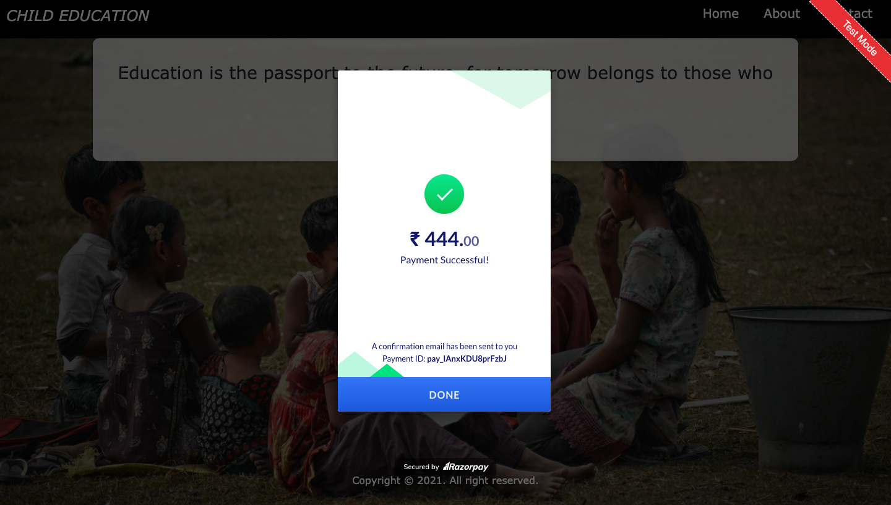

# Payment-Gateway

## Introduction

A responsive website is made using HTML and CSS with an integrated payment gateway for donation. In this project , a website is made in order to get donations for the education of children who's parents can't afford schooling and other basic expenses of the child.

The project is made during the Internship @ The Sparks Foundation (#GRIPOCT2021)

## Features

### Home Page

### About Page

### Contact Page

### Donation Page

## Tech Stack
+ HTML
+ CSS

## Payment Gateway
+ RazorPay

## Developers
<table>
<td>

Mahima Khatri

</td>
</tr>
</table>

